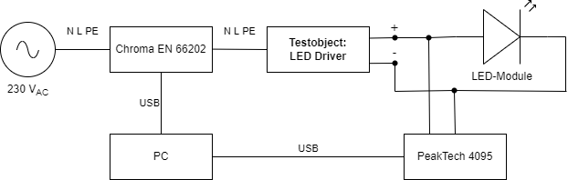
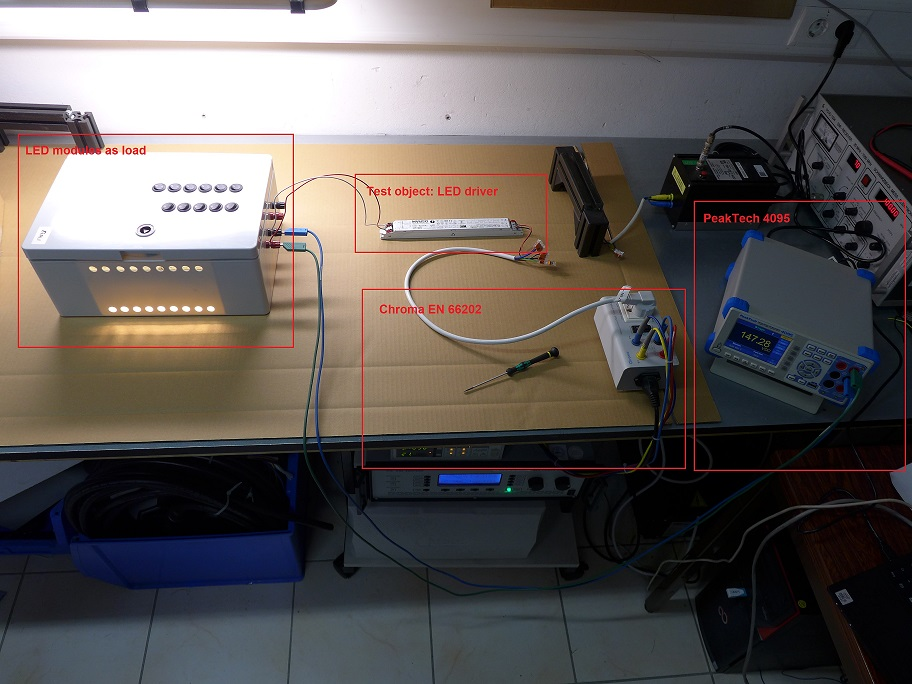

# MELT
Python script for measurement of LED control gears.

## Requirements
- Python
- Chroma EN 66202 installation
    1. SoftPanel v1.2.2.4 installieren und neu starten
    2. IVI-Shared Components installieren und neu starten (ni-icp_19.5.0_offline.iso)
    3. NI-VISA installieren und neu starten (NIVISA1750full.exe)
        - NI-VISA to control measurement devices
        - Download and install NI-VISA on Windows systems
        - https://www.ni.com/de-de/support/downloads/drivers/download.ni-visa.html#409839

 ## Measurement device
 - Chroma EN 66202
    - power (input)
    - power factor
    - total harmonic distortion (voltage)
 - PeakTech 4095
    - voltage DC (output)
 - UNI-T UT161-E
    - current DC (output)

## Load - LED modules
- 6x Fortimo LED Strip 1ft 1100lm 830 FC HV5
- 6x Fortimo LED Strip 1ft 1100lm 940 FC LV5

## Measurement setup

- Voltage correct circuit to measure DC voltage output
- Measuring devices needs to be connected before starting the Python script
- Don't change PeakTech 4095 measurement mode after starting the Python script. This could lead to wrong measurement results.
- Control and input DC current using UT161-E multimeter.

